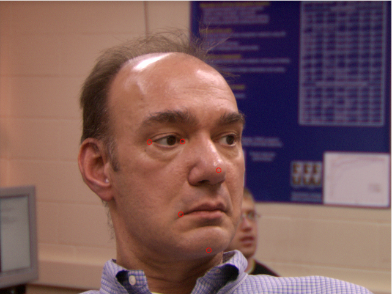
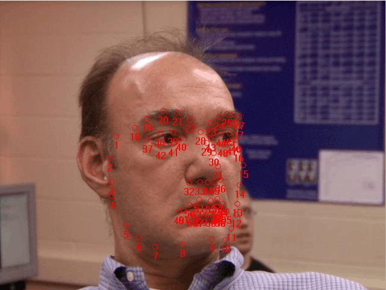

## 3D facial landmark localization

### Reference
@article{sukno20153, 
  title={3-D facial landmark localization with asymmetry patterns and shape regression from incomplete local features}, 
  author={Sukno, Federico M and Waddington, John L and Whelan, Paul F}, 
  journal={IEEE transactions on cybernetics}, 
  volume={45}, 
  number={9}, 
  pages={1717--1730}, 
  year={2015}, 
  publisher={IEEE} 
}

### Instructions

* ./files include *.pts files and *.abs files. Please refer to meshSpin.m for detailed info.

* ./spin_imgs include spin image feature of the samples.

* main.m contains steps of the algorithm.

* calcSpinImages.m calculates the spin image feature of each vertex on input mesh.

* extract_abs.m is used to read info from *.abs file, including flag and 3D-coordinate.

* read_shape.m is used to read 2D-coordinate from *.pts file.

* meshSpin.m obtains the spin image feature and 3D-coordinate of input mesh, the spin image and 3D-coordinate of keypoints. Note: the *.pts parameter should be NULL for test samples, as their locations are unknown.

### Examples
Here are images including 5 keypoints and 68 keypoints, respectively.

